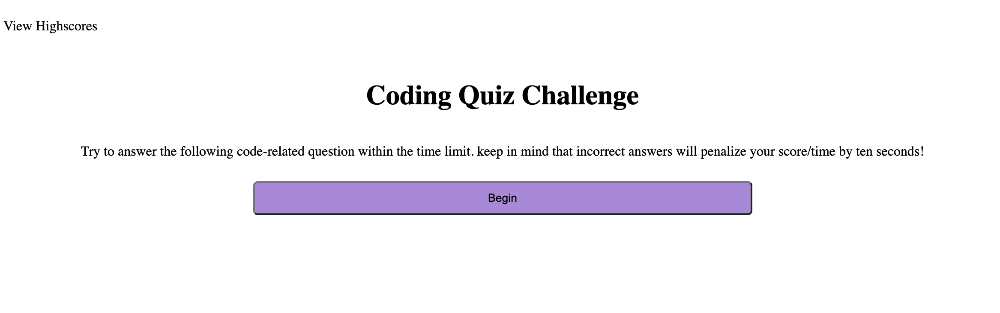

# Fun-Code-Quiz

## Description
This is a short quiz about the basics of JavaScript. Individuals are on a time limit, and can answer up to 10 questions about JavaScript. 
## Installation 
N/A

## Usage
Individuals are on a time limit, and can answer up to 10 questions about JavaScript. If an individual runs out of time, or reaches the end of the 10 questions they will be shown their score and asked to enter in their name. That information is then stored and displayed in the 'Highscore' page, that can be accessed after one finishes the game, or by clicking the 'View Highscores' button in the top left corner. If a user gets a question wrong they are penalized by losing 10 second from the alloted time. 

## Credits
https://www.w3schools.com/quiztest/quiztest.asp?qtest=JS
I used this site to base some of my JavaScript questions on

## License
N/A

## Link to Application
